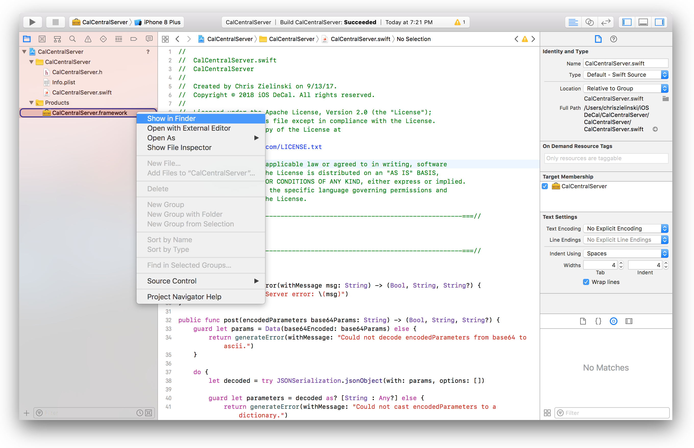
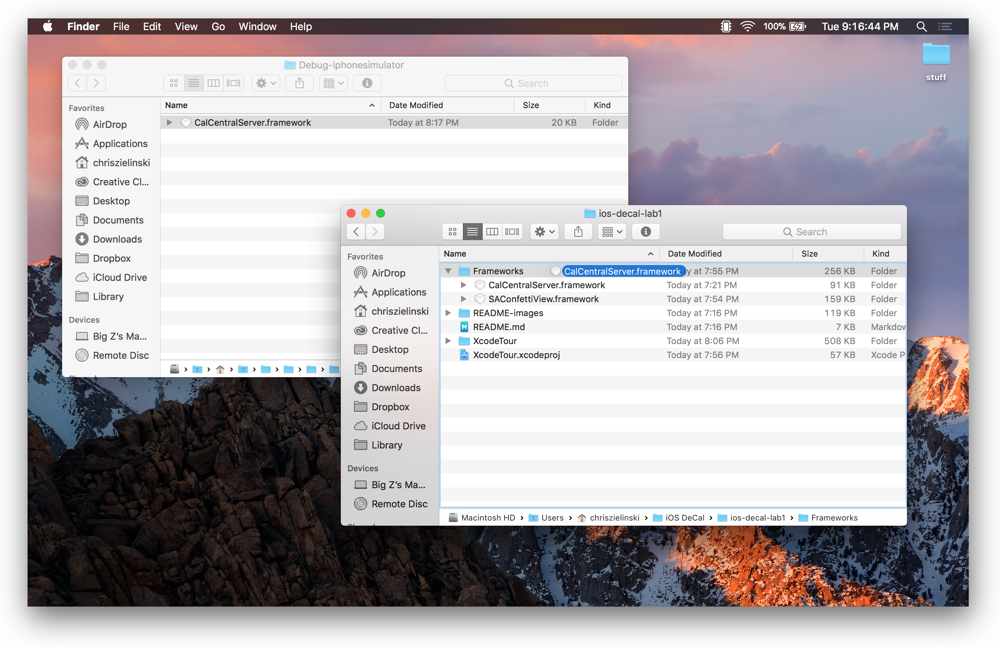

# CalCentralServer — Framework used in lab1 (XcodeTutorial)

## Overview
This framework will most likely need to be recompiled using the newest Swift version each semester. Simply,

1. Open & build the project (⌘B)
2. Expand the *Products* folder, right click on the framework, and *Open in Finder*.

3. Drag the built framework to the *Frameworks* folder in the lab directory replacing the previous version.

